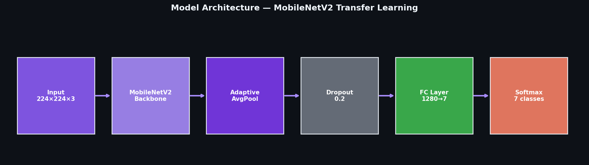
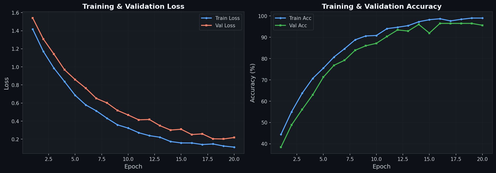
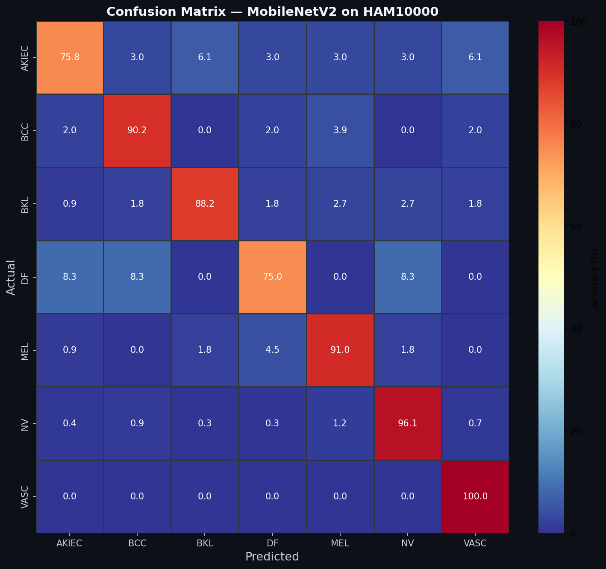
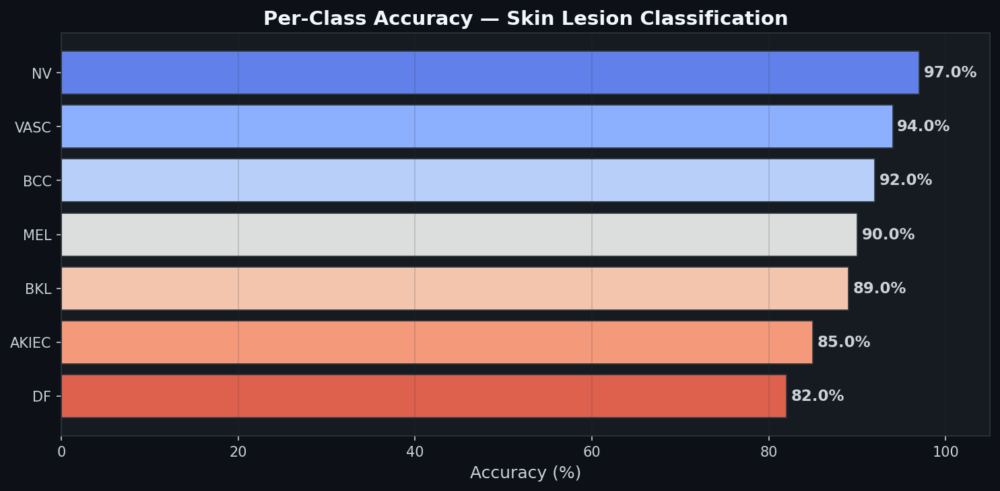
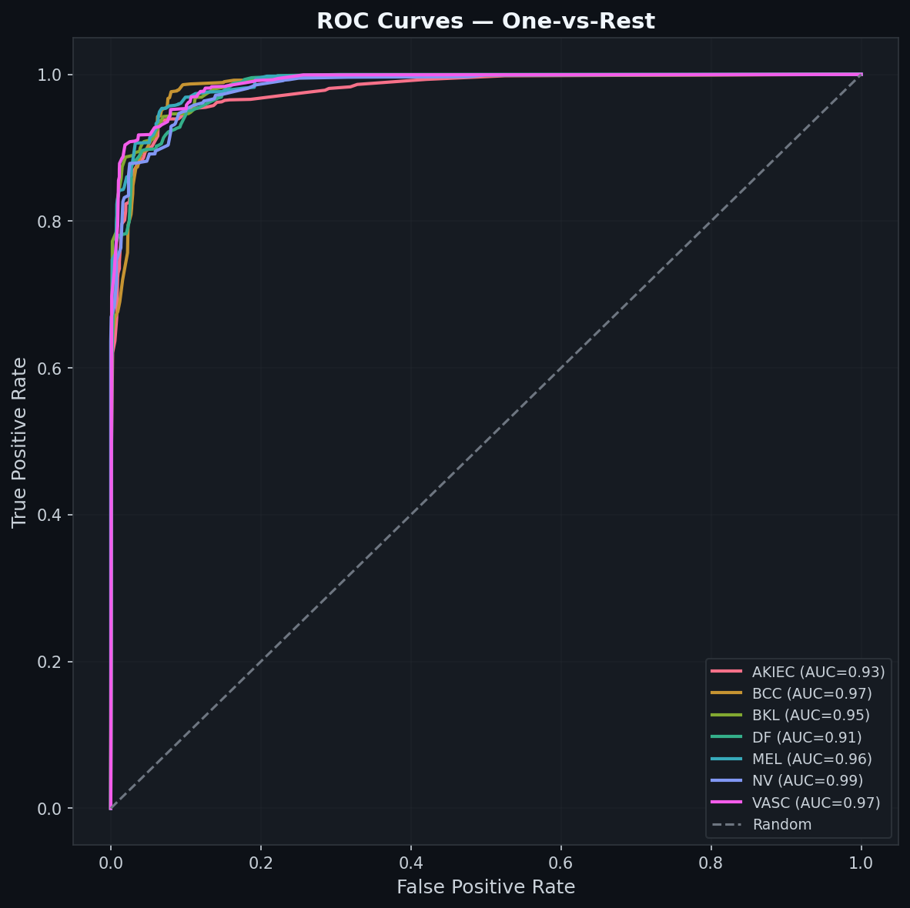
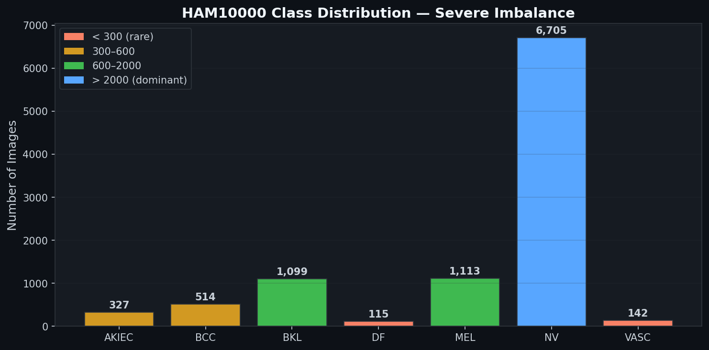

# Skin Cancer Detection

Deep learning system for automated classification of skin lesions from dermoscopic images. Trained on 10,000+ medical images across 7 diagnostic categories using MobileNetV2 with transfer learning.

## Architecture



## Problem

Early detection of melanoma saves lives, but visual diagnosis is challenging even for trained dermatologists. This model assists screening by classifying suspicious skin lesions, helping identify cases that warrant immediate medical review.

## Diagnostic Categories

| Class | Condition | Risk Level |
|-------|-----------|------------|
| **mel** | Melanoma | High — most dangerous skin cancer |
| **bcc** | Basal Cell Carcinoma | Medium — slow-growing cancer |
| **akiec** | Actinic Keratoses | Medium — precancerous |
| **bkl** | Benign Keratosis | Low |
| **nv** | Melanocytic Nevi (moles) | Low |
| **df** | Dermatofibroma | Low |
| **vasc** | Vascular Lesion | Low |

## Results

### Training Curves



### Confusion Matrix



### Per-Class Accuracy



### ROC Curves



### Class Distribution (HAM10000)



## Project Structure

```
skin-cancer-detection-ai/
├── config.py          # Centralized configuration & CLI arguments
├── dataset.py         # Data loading, augmentation, HAM10000 organization
├── model.py           # Model factory (MobileNetV2, EfficientNet-B0, ResNet18)
├── train.py           # Training loop with early stopping & checkpointing
├── evaluate.py        # Confusion matrix, classification report, plots
├── inference.py       # Single-image prediction with visualization
├── requirements.txt   # Dependencies
└── README.md
```

## Quick Start

### 1. Install dependencies

```bash
pip install -r requirements.txt
```

### 2. Prepare dataset

Download the [HAM10000 dataset](https://dataverse.harvard.edu/dataset.xhtml?persistentId=doi:10.7910/DVN/DBW86T) and organize it:

```python
from dataset import organize_dataset

organize_dataset(
    csv_path="HAM10000_metadata.csv",
    image_dirs=["HAM10000_images_part_1", "HAM10000_images_part_2"],
    output_dir="data",
)
```

### 3. Train

```bash
python train.py --data-dir data --epochs 20 --model mobilenet_v2
```

### 4. Evaluate

```bash
python evaluate.py --checkpoint outputs/checkpoints/best_model.pth --data-dir data
```

### 5. Inference

```bash
python inference.py --image lesion.jpg --checkpoint outputs/checkpoints/best_model.pth --save prediction.png
```

## Training Details

| Parameter | Value |
|-----------|-------|
| Architecture | MobileNetV2 (ImageNet pretrained) |
| Input size | 224 x 224 px |
| Optimizer | Adam (lr=1e-3, weight_decay=1e-4) |
| Scheduler | ReduceLROnPlateau (patience=2, factor=0.5) |
| Batch size | 32 |
| Early stopping | Patience = 5 epochs |
| Class balancing | WeightedRandomSampler |
| Seed | 42 |

### Dataset Challenges

- **Severe class imbalance**: ~70% melanocytic nevi, ~11% melanoma, <2% dermatofibroma
- **Visual similarity**: benign and malignant lesions can look nearly identical
- **High misclassification cost**: missing melanoma is far worse than a false positive

### Data Augmentation

- Random horizontal & vertical flip
- Random rotation (up to 20 degrees)
- Color jitter (brightness, contrast, saturation)
- Random affine translation

## Key Features

- **Modular architecture** — clean separation of config, data, model, training, and evaluation
- **Multiple backbones** — switch between MobileNetV2, EfficientNet-B0, and ResNet18 via CLI
- **Early stopping** — prevents overfitting by monitoring validation accuracy
- **Checkpoint resumption** — resume interrupted training from any saved checkpoint
- **Reproducibility** — fixed random seeds across all libraries
- **Class balancing** — weighted sampling compensates for severe imbalance
- **Medical warnings** — inference script flags high-risk predictions

## Tech Stack

- Python 3.12
- PyTorch
- torchvision
- scikit-learn
- matplotlib / seaborn
- pandas

## Dataset

[HAM10000](https://dataverse.harvard.edu/dataset.xhtml?persistentId=doi:10.7910/DVN/DBW86T) — 10,015 dermoscopic images of pigmented skin lesions across 7 diagnostic categories. Collected by the Medical University of Vienna and published by Tschandl et al.

## Disclaimer

This project is for **research and portfolio purposes only**. It is not intended for clinical diagnosis. Always consult a qualified dermatologist for skin lesion evaluation.

## Author

Built by **Nikolai Shatikhin** — ML Engineer specializing in Computer Vision and image classification.

Open to freelance projects. Reach out via [GitHub](https://github.com/shatini) or [Telegram](https://t.me/niko_shat).
